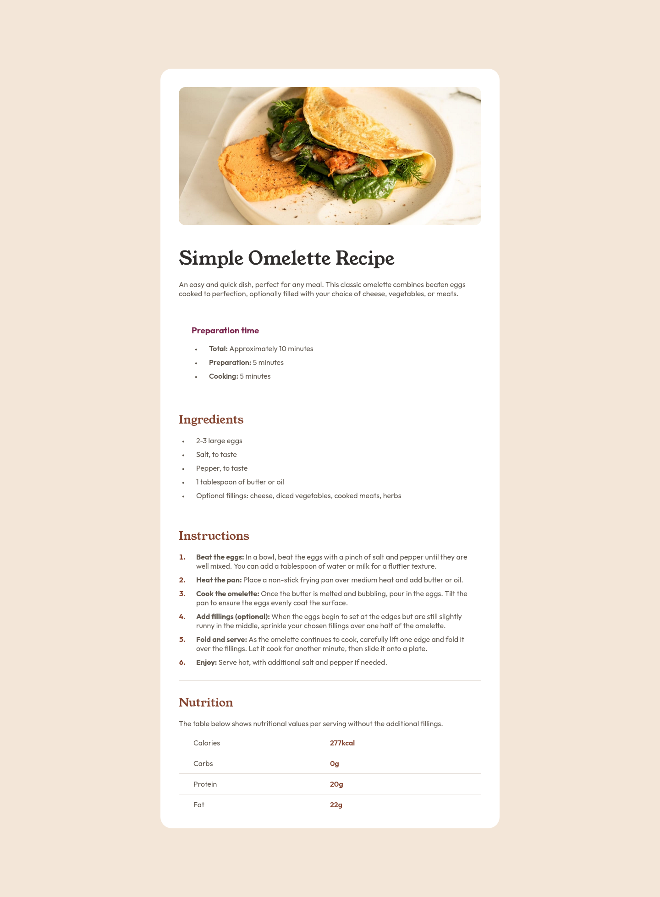

# Frontend Mentor - Solução para a página de receitas

Projeto feito através do desafio do site Frontend Mentor com o objetivo de estudo.

### Links

- URL da Solução: [Solução](https://www.frontendmentor.io/solutions/recipe-page-Jq0YlF-_OB)
- URL do Site ao Vivo: [Projeto](https://lohan-martins.github.io/recipe-page-frontend-mentor-challenge/)

## Meu Processo

### Construído com

- Marcação HTML5 semântica
- Propriedades personalizadas de CSS
- Flexbox

### Minha experiência durante o desafio

Durante o desafio da página de receitas, tive a experiência de desenvolver a estrutura HTML inicial da página apenas olhando o modelo dado como exemplo. Foi algo que não achei tão difícil, porém recompensador. A dor de cabeça foi na estilização, já que tive que supor informações como o tamanho da fonte, padding e margens, entre outras. Mas não me deixei abalar e tentei dar o meu melhor.

### Aprendizado

Durante o desafio, tive a oportunidade de praticar minhas habilidades com HTML, CSS e Git, além de descobrir algumas novas técnicas e truques.

### Desenvolvimento Contínuo

Espero continuar fazendo desafios, projetos e estudando para melhorar minhas habilidades e me tornar um excelente desenvolvedor.

## Autor

- Frontend Mentor - [@Lohan-Martins](https://www.frontendmentor.io/profile/Lohan-Martins)
- LinkedIn - [Lohan Martins](https://www.linkedin.com/in/lohan-martins-798297217/)

## Agradecimentos

A realização desse desafio só foi possível graças ao site [Frontend Mentor](https://www.frontendmentor.io/home), que possui, além desse, vários outros desafios para desenvolvedores web treinarem suas habilidades.

  <h3>Imagem de demonstração - Desktop</h3>
  
  

